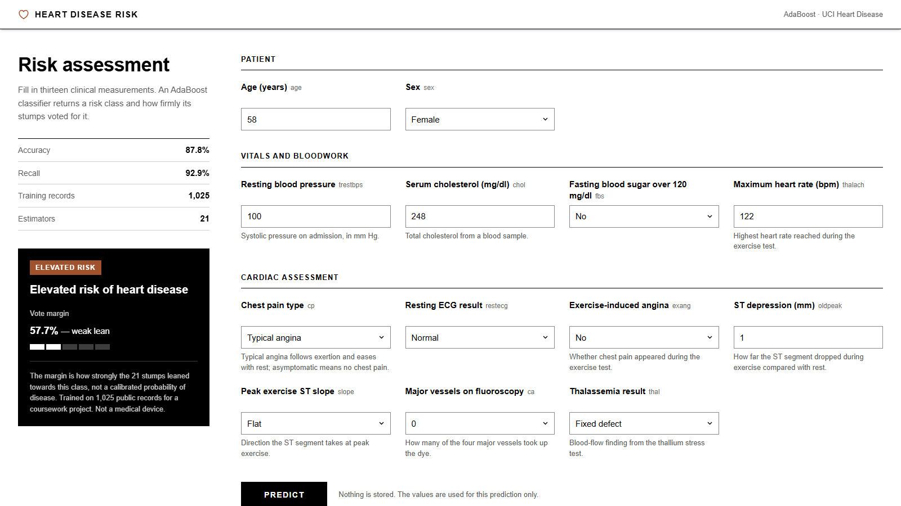
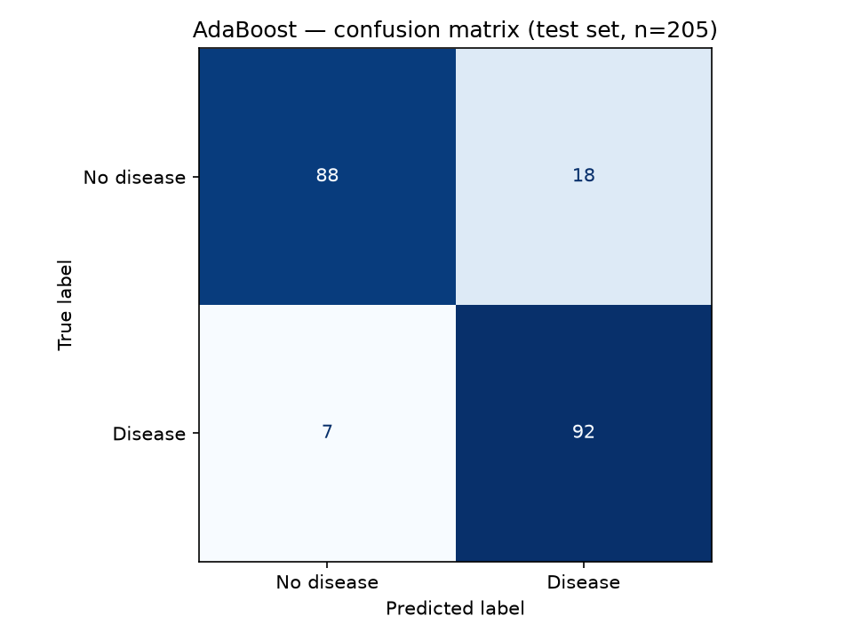
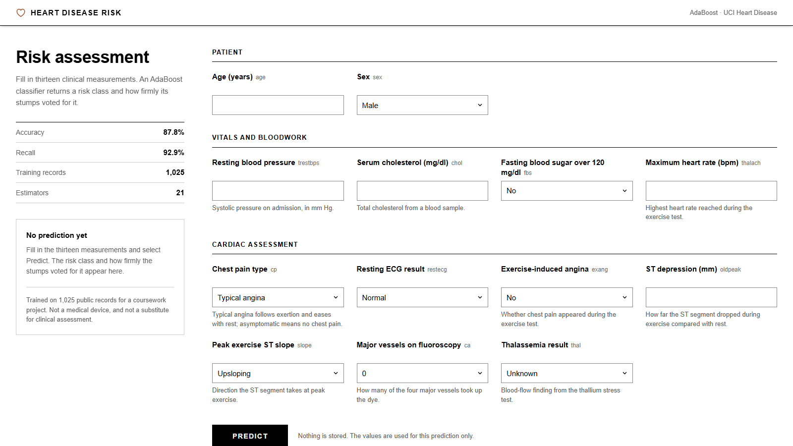
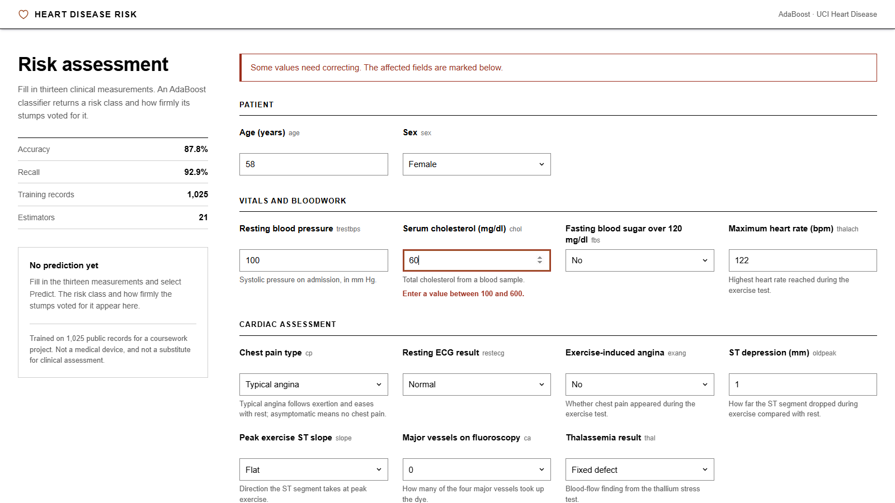

# Heart Risk Estimator — AdaBoost, Django API, React

Predicts whether a patient has heart disease from thirteen routine clinical measurements. An AdaBoost
classifier is trained on the UCI Heart Disease dataset in a Jupyter notebook, serialised with joblib, and
served through a Django JSON API that validates the thirteen inputs before they reach the model. The
interface is a React + TypeScript single-page app that renders itself from the API's own description of
the form. On a held-out test set the model reaches **87.8% accuracy** and **92.9% recall** on the disease
class, against 74.6% for a single decision stump, the weak learner AdaBoost is built from.



## Results

Test set: 205 records held out from 1,025 by a random 80/20 split. Seeds are fixed, so these numbers
reproduce exactly by re-running the notebook.

| Metric | AdaBoost (n_estimators=21) | Baseline (single decision stump) |
|---|---|---|
| Accuracy | 87.8% | 74.6% |
| Precision (disease) | 83.6% | — |
| Recall (disease) | 92.9% | — |
| F1 (disease) | 88.0% | — |

Boosting 21 stumps adds **13.2 percentage points** of accuracy over one stump.

### Confusion matrix

|  | Predicted: no disease | Predicted: disease |
|---|---|---|
| **Actual: no disease** | 88 | 18 |
| **Actual: disease** | 7 | 92 |



The model misses 7 of the 99 patients who actually have heart disease, and raises 18 false alarms among
the 106 who do not. That asymmetry is the useful one here: a missed case sends someone home untreated,
while a false alarm costs a follow-up test. Recall on the disease class is therefore the metric to judge
this model on, not accuracy, and at 92.9% it is the strongest of the four figures above.

Precision is the weaker number. Roughly one in six positive predictions is wrong, so this would function
as a screening step that decides who gets investigated further, never as a decision on its own.

## Dataset

[UCI Heart Disease](https://archive.ics.uci.edu/dataset/45/heart+disease), the Cleveland subset,
collected in 1988. The copy used here (`backend/heart.csv`) is the widely redistributed 1,025-row
expansion of the original 303 records. 13 features, binary target, near-balanced at 526 positive / 499
negative. No missing values.

| Feature | Meaning |
|---|---|
| `age`, `sex` | Demographics |
| `trestbps`, `chol`, `fbs` | Resting blood pressure, serum cholesterol, fasting blood sugar > 120 mg/dl |
| `thalach`, `exang`, `oldpeak`, `slope` | Exercise test: max heart rate, induced angina, ST depression, ST slope |
| `cp`, `restecg`, `ca`, `thal` | Chest pain type, resting ECG, vessels on fluoroscopy, thallium stress result |

The 1,025 rows contain duplicated records. See [Limitations](#limitations).

## Architecture

```
heart_disease.ipynb  ──dump()──▶  adaboost.joblib  ──load()──▶  predictor/views.py
                                                                       │
                   predictor/form.py  (TestForm: 13 validated fields) ─┤
                                                                       │
                                        GET  /api/schema/   ◀──────────┤
                                        POST /api/predict/  ◀──────────┘
                                                 ▲
                                                 │  fetch
                                        frontend/src  (React + TypeScript)
                                                 │  vite build
                                                 ▼
                                predictor/static/frontend/{app.js,app.css}
                                                 │  
                                                 ▼
                                        templates/index.html  (page shell)
```

Four decisions worth calling out:

**The form is the validation layer.** `views.py` never reads the request body directly. The JSON is bound
to the same `TestForm` the server-rendered version used, and only `form.cleaned_data` reaches the
classifier. Each field carries the range the dataset documentation defines, and
`TypedChoiceField(coerce=int)` means the view receives real integers rather than strings.

**The client is told what the form is.** `GET /api/schema/` returns every field's label, help text, bounds
and options, plus the section grouping, all derived from `form.py`. The React app renders from that and
never hard-codes a field name, a range or a choice, so the browser cannot drift from what the server will
accept, and regrouping the UI stays a one-line change in Python.

**`FEATURE_ORDER` is the contract between the notebook and the app.** It mirrors the column order the
model was fitted on, and getting it wrong is silent: the model would read cholesterol as a heart rate and
still return a confident answer. `views.py` therefore checks `FEATURE_ORDER` against the estimator's own
`feature_names_in_` once at import and refuses to start on a mismatch, rather than validating the order
on every request by rebuilding a named `DataFrame`.

**The model loads once at import**, not per request, via an absolute path derived from `BASE_DIR`.

Clinical inputs are sent by POST, never in a query string, so they stay out of server logs and browser
history. Nothing is persisted; the app has no database models. The prediction endpoint is CSRF-protected
rather than exempted: the shell view sets the cookie and the client echoes it back as `X-CSRFToken`.

## API

| Route | Method | Returns |
|---|---|---|
| `/` | GET | The page shell, which loads the built React bundle |
| `/api/schema/` | GET | The thirteen field definitions, their display grouping, and the model card |
| `/api/predict/` | POST | `{"result": {...}}`, or `400` with `{"errors": {field: [message]}}` |

```bash
curl -X POST http://127.0.0.1:8000/api/predict/ -H 'Content-Type: application/json' \
  -d '{"age":58,"sex":0,"cp":0,"trestbps":100,"chol":248,"fbs":0,"restecg":0,
       "thalach":122,"exang":0,"oldpeak":1.0,"slope":1,"ca":0,"thal":2}'
# {"result": {"isHighRisk": true, "verdict": "Elevated risk of heart disease",
#             "badge": "Elevated risk", "confidence": 57.7, "bandLabel": "weak lean",
#             "bandScale": [true, true, false, false, false]}}
```

## Tech stack

Python 3.12 · Django 5.2 · scikit-learn 1.9 · NumPy · joblib · WhiteNoise, with pandas, Jupyter and
matplotlib/seaborn confined to the notebook (`requirements-dev.txt`)

React 19 · TypeScript 5.9 · Vite 7 · Vitest + React Testing Library (15 tests covering the form, the
result panel, validation and focus handling)

The interface is hand-written CSS with no UI framework, no CDN and no web fonts. Everything is bundled
locally, so the app renders correctly with no network access. It is keyboard-navigable, has no animation
to sit through, and wires help text and validation errors to their inputs with `aria-describedby`. The
two outcomes are told apart by badge text and wording as well as by treatment, never by colour alone.

Moving to React cost the no-JavaScript path: the previous version was a plain form post and worked with
scripting disabled. The API is still usable directly (see above), and the page says so if JavaScript is
off.

## Quick start

```bash
git clone https://github.com/nqghuy1202/heart_risk_estimator.git
cd heart_risk_estimator/backend

python -m venv .venv
source .venv/bin/activate        # Windows: .venv\Scripts\activate

pip install -r requirements.txt
python manage.py migrate
python manage.py runserver
```

Then open <http://127.0.0.1:8000/>. **Node is not needed to run the app.** The built bundle is committed
under `backend/predictor/static/frontend/`.

### Working on the interface

```bash
cd frontend
npm install
npm test                # Vitest + React Testing Library
npm run build           # rebuilds the committed bundle into the Django static directory
npm run dev             # Vite on :5173, proxying /api to Django on :8000
```

`npm run dev` expects `python manage.py runserver` to be running alongside it.

To re-run the training notebook and regenerate `adaboost.joblib` and the confusion matrix:

```bash
pip install -r requirements-dev.txt
jupyter nbconvert --to notebook --execute --inplace heart_disease.ipynb
```

## Deployment

Deployed to Vercel as a single Python serverless function. `api/index.py` puts `backend/` on the import
path and exports Django's WSGI callable as `app`; `vercel.json` rewrites every path to it, so one
function serves the page shell and both endpoints. WhiteNoise serves the committed bundle through the
staticfiles finders, which means no `collectstatic` step and nothing written to a read-only filesystem.

`settings.py` reads `DJANGO_SECRET_KEY` and `DJANGO_ALLOWED_HOSTS` from the environment and keys the rest
off `VERCEL`, which the platform sets itself: `DEBUG` off, SQLite pointed at `/tmp`, and
`SECURE_PROXY_SSL_HEADER` set so Django sees the scheme through the proxy. Locally none of that applies
and `runserver` behaves as before.

The constraint that shaped this is the 250 MB uncompressed function limit. scipy, NumPy, scikit-learn and
Django come to 229 MB unzipped; adding pandas makes it 274 MB and the deployment fails. pandas was only
building a one-row `DataFrame` per request, so it moved to `requirements-dev.txt` and the feature-order
check described above took over the job it was really doing. That leaves roughly 20 MB of headroom, which
is the reason for the last of the [next steps](#next-steps).

```bash
vercel --prod
```

## Screenshots

| Empty form | Validation errors |
|---|---|
|  |  |

The thirteen inputs are grouped into three sections, and every dataset abbreviation is spelled out in
plain English beneath its field, since `oldpeak` is not a term most people filling in this form would
know. Out-of-range values are rejected server-side with the accepted range stated in the message, and the
other twelve answers are preserved.

## Project structure

```
heart_risk_estimator/
├── api/index.py                   # Vercel entry point: exports the Django WSGI app
├── vercel.json                    # one function, every route rewritten to it
├── requirements.txt               # points at backend/requirements.txt for the build
├── backend/
│   ├── heart_disease.ipynb        # training: EDA, baseline, model selection, evaluation, export
│   ├── heart.csv                  # UCI dataset, 1,025 records
│   ├── adaboost.joblib            # the fitted classifier the app loads
│   ├── predictor/
│   │   ├── form.py                # 13 validated fields, FEATURE_ORDER, grouping, schema
│   │   ├── views.py               # page shell + the two JSON endpoints
│   │   ├── urls.py
│   │   └── static/
│   │       ├── predictor/         # favicon
│   │       └── frontend/          # the built React bundle (committed)
│   ├── templates/index.html       # page shell: loads the bundle, nothing else
│   ├── config/                    # Django project settings
│   ├── requirements.txt
│   └── requirements-dev.txt
├── frontend/                      # React + TypeScript source
│   ├── src/
│   │   ├── api.ts                 # the Django boundary: types, CSRF, fetch
│   │   ├── App.tsx                # state: schema, values, errors, result
│   │   ├── App.test.tsx           # 15 tests
│   │   ├── components/            # TopBar, PredictionForm, Field, Verdict, Awaiting
│   │   └── styles/app.css
│   └── vite.config.ts             # builds into the Django static directory
└── docs/                          # screenshots and the confusion matrix plot
```

## Limitations

These affect how much weight the numbers above deserve.

- **`n_estimators` was selected on the test set.** There is no validation split and no cross-validation,
  so the reported 87.8% is mildly optimistic: the test set influenced a modelling choice. The fix is a
  three-way split or `GridSearchCV` on the training set alone.
- **The dataset contains duplicated rows.** The 1,025-record version is an expansion of the original 303
  records, so identical patients can appear in both the train and test splits. This inflates every metric
  here, and is the largest single caveat.
- **The split is not stratified.** `train_test_split` is called without `stratify=y`, so the positive
  rate drifts between the two halves (52.1% train, 48.3% test). Harmless on a near-balanced dataset, but
  it is one more source of variance in the reported figures.
- **No feature scaling and no calibration.** Tree-based learners do not need scaling, but the confidence
  percentage shown in the app comes from AdaBoost's weighted vote rather than a calibrated probability.
  It indicates relative confidence, not a real likelihood of disease.
- **Small and unrepresentative.** A few hundred distinct patients from 1980s clinical studies. Nothing
  here would generalise to a present-day population without retraining.
- **Not a medical device.** This is a portfolio project demonstrating an end-to-end ML workflow. It is
  not validated for clinical use and must not inform any real decision about a patient.

## Next steps

- Replace test-set selection with `GridSearchCV` on the training split, and deduplicate before splitting.
- A pytest suite covering form validation, the feature-order contract, the two endpoints and both
  prediction branches. The front end has tests, the back end does not yet.
- Docker packaging and a GitHub Actions pipeline.
- Trim the deployed bundle. scipy and NumPy are 166 MB of a 250 MB limit, imported so that 21 decision
  stumps can cast a weighted vote. Exporting the stumps to JSON and scoring them in pure Python would
  drop every scientific dependency and most of the cold start, at the cost of reimplementing
  `predict_proba`.
